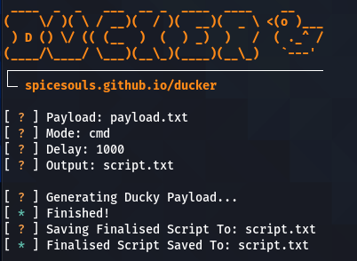

# 🦆 Ducker

### A lightweight ducky script generator written in python.



[](https://forthebadge.com)
[](https://forthebadge.com)

### ☑️ Generating scripts that write your payload to:

* cmd
* Powershell
* Notepad

### 🛠 Installation

```sh
git clone https://github.com/spicesouls/ducker
cd ducker && pip install -r requirements.txt
chmod +x ducker.py
./ducker.py -h
```

### 📃 Usage

```
./ducker.py [-h] [--payload PAYLOAD] [-m MODE] [-d DELAY] [-o OUTPUT]
```

### 📖 Example Payloads

#### Opening a Rickroll Video with Powershell
`ducker/examples/rickroll_powershell.txt`
#### Writing 'HACKED BY THE DUCKY!' in Notepad
`ducker/examples/hacked_ascii_art_notepad.txt`


My Blog: https://beyondrootsec.wordpress.com

**🚧! THIS IS FOR STRICTLY EDUCATIONAL PURPOSES, I AM NOT RESPONSIBLE FOR YOUR USE OF THIS !🚧**

[License](LICENSE)
